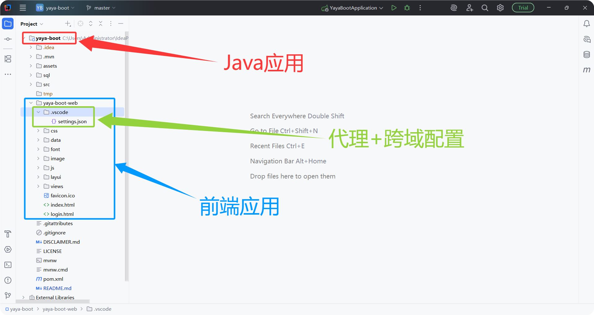
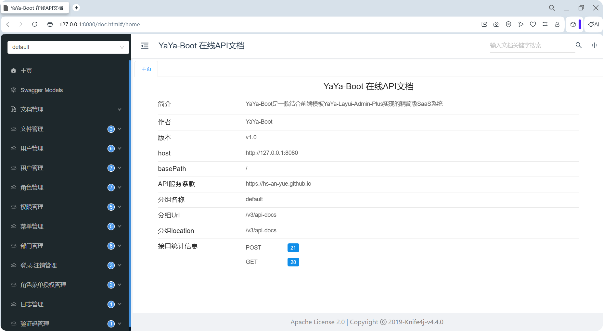
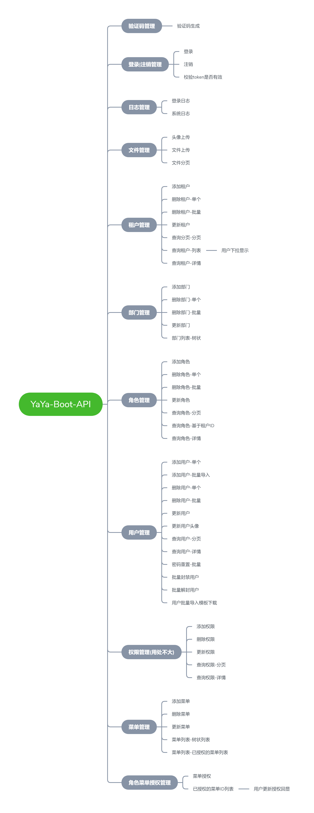

<div align="center">
    
</div>

---

# <div align="center">YaYa-Boot</div>
#### <div align="center"> 一款精简版的SaaS应用 </div>
<div align="center">
	<a href="https://gitee.com/ukoko/yue-an-mini-plus"></a>
    <a href="https://gitee.com/ukoko/yue-an-mini-plus"></a>
    <a href="https://gitee.com/ukoko/yue-an-mini-plus"></a>
    <a href="https://gitee.com/ukoko/yue-an-mini-plus"></a>
    <a href="https://gitee.com/ukoko/yue-an-mini-plus"></a>
	<a href="https://gitee.com/ukoko/yue-an-mini-plus"></a>
</div>

#### 介绍
`YaYa-Boot` 基于 [SpringBoot3.5.10](https://spring.io/) 框架结合 [YaYa-Layui-Admin-Plus](https://gitee.com/ukoko/yaya-layui-admin-plus) 前端模板实现的一款多租户 `SaaS` 服务，`YaYa-Boot` 提供了一套最简化的 `SaaS` 模板，方便用户扩展和使用。

#### 项目结构



```
前端项目使用vscode开发工具运行 .vscode中的配置已帮助解决前后端联调的跨域问题.
```

#### 技术栈介绍

<table>
<thead>
<tr>
<td>技术名称</td>
<td>版本</td>
<td>备注</td>
<td>文档</td>
</tr>        
</thead>
<tbody>
<tr>
<td>JDK</td>
<td>21</td>
<td>SpringBoot3.5.10 最低需要JDK17</td>
<td>https://www.oracle.com/cn/</td>
</tr>
<tr>
<td>SpringBoot</td>
<td>3.5.10</td>
<td>🌟</td>
<td>https://docs.spring.io/spring-boot/index.html</td>
</tr>
<tr>
<td>SpringSecurity</td>
<td>6.5.7</td>
<td>权限采用RBAC模式</td>
<td>https://spring.io/projects/spring-security/</td>
</tr>
<tr>
<td>MyBaits-Plus</td>
<td>3.5.15</td>
<td>ORM框架</td>
<td>https://baomidou.com</td>
</tr>
<tr>
<td>java-jwt</td>
<td>4.4.0</td>
<td>token生成工具</td>
<td>https://jwt.io/</td>
</tr>
<tr>
<td>ip-info</td>
<td>2.1.7</td>
<td>ip地址定位 ipv4,ipv6</td>
<td>https://gitee.com/jthinking/ip-info</td>
</tr>
<tr>
<td>hutool-all</td>
<td>5.8.43</td>
<td>Hutool工具箱</td>
<td>https://doc.hutool.cn/</td>
</tr>
<tr>
<td>slf4j+logback</td>
<td>跟随SpringBoot版本</td>
<td>日志</td>
<td>https://spring.io/</td>
</tr>
<tr>
<td>pagehelper</td>
<td>2.1.0</td>
<td>分页插件</td>
<td>https://github.com/pagehelper/pagehelper-spring-boot</td>
</tr>
<tr>
<td>knife4j</td>
<td>4.4.0</td>
<td>在线API文档工具</td>
<td>https://doc.xiaominfo.com/</td>
</tr>
<tr>
<td>lombok</td>
<td>跟随SpringBoot版本</td>
<td>Java库(get/set/构造器/日志等)</td>
<td>https://spring.io/</td>
</tr>
<tr>
<td>mybatisplus-plus</td>
<td>1.7.5-RELEASE</td>
<td>解决mybatis-plus框架不支持联合主键问题</td>
<td>https://gitee.com/jeffreyning/mybatisplus-plus</td>
</tr>
<tr>
<td>tika</td>
<td>3.2.3</td>
<td>校验文件上传时,文件真实类型的问题</td>
<td>https://tika.apache.org/</td>
</tr>
</tbody>
</table>


#### API接口文档
```
访问地址: http://127.0.0.1:8080/doc.html
```



#### 功能介绍




> 文档持续更新~~
